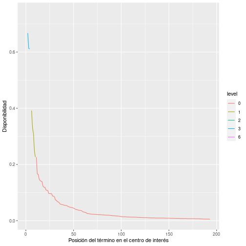
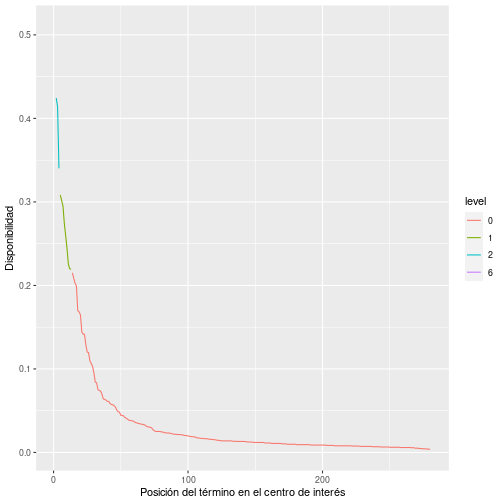
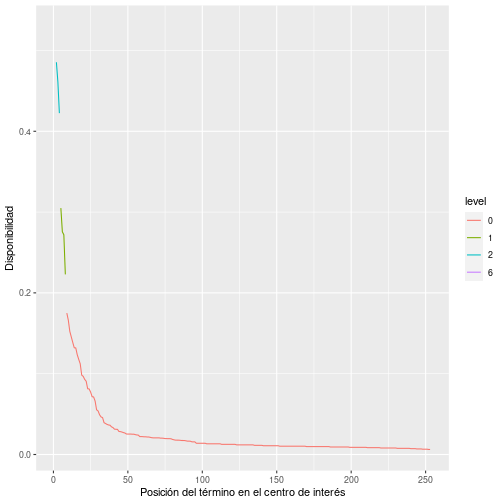
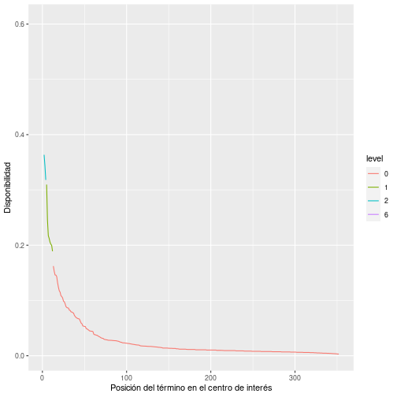

*Store this file in the same directory where your data is stored
# Carga de librerías

```r
library(tidyverse)
library(displex)
```
# Carga de datos

```r
data <- read.displex("datos.txt")
data %>% 
  head()
```

```
##   infos users centers        words
## 1 21131   001      01 mano, pi....
## 2 12131   002      01 riñón, c....
## 3 12213   003      01 brazo, m....
## 4 22214   004      01 brazo, o....
## 5 12214   005      01 cabeza, ....
## 6 22213   006      01 pie, man....
```

# Modelo de disponibilidad

```r
disponibilidad <- build.lopezstrass.availability(data)
disponibilidad %>% head()
```

```
## # A tibble: 6 x 8
##   centers words  order availability freq.abs freq.rel freq.abs.cum freq.rel.cum
##   <chr>   <chr>  <int>        <dbl>    <int>    <dbl>        <int>        <dbl>
## 1 01      ojo        1        0.633       58   0.0374           58       0.0374
## 2 01      brazo      2        0.552       50   0.0322          108       0.0696
## 3 01      pierna     3        0.507       49   0.0316          157       0.101 
## 4 01      mano       4        0.489       42   0.0271          373       0.240 
## 5 01      cabeza     5        0.478       37   0.0239          410       0.264 
## 6 01      pie        6        0.450       43   0.0277          331       0.213
```

## Centros de interés
### Centro de interés: 01

```r
disponibilidad %>% 
  filter(centers=="01") %>% 
  arrange(-availability)
```


```r
disponibilidad %>% 
  filter(centers=="01") %>% 
  arrange(-availability) %>% 
  ggplot(aes(x=order, y=availability)) + geom_line() +
  xlab("Sucesión de palabras") + ylab("Disponibilidad")
```


### Centro de interés: 02

```r
disponibilidad %>% 
  filter(centers=="02") %>% 
  arrange(-availability)
```


```r
disponibilidad %>% 
  filter(centers=="02") %>% 
  arrange(-availability) %>% 
  ggplot(aes(x=order, y=availability)) + geom_line() +
  xlab("Sucesión de palabras") + ylab("Disponibilidad")
```


### Centro de interés: 03

```r
disponibilidad %>% 
  filter(centers=="03") %>% 
  arrange(-availability)
```


```r
disponibilidad %>% 
  filter(centers=="03") %>% 
  arrange(-availability) %>% 
  ggplot(aes(x=order, y=availability)) + geom_line() +
  xlab("Sucesión de palabras") + ylab("Disponibilidad")
```


### Centro de interés: 04

```r
disponibilidad %>% 
  filter(centers=="04") %>% 
  arrange(-availability)
```


```r
disponibilidad %>% 
  filter(centers=="04") %>% 
  arrange(-availability) %>% 
  ggplot(aes(x=order, y=availability)) + geom_line() +
  xlab("Sucesión de palabras") + ylab("Disponibilidad")
```


### Centro de interés: 05

```r
disponibilidad %>% 
  filter(centers=="05") %>% 
  arrange(-availability)
```


```r
disponibilidad %>% 
  filter(centers=="05") %>% 
  arrange(-availability) %>% 
  ggplot(aes(x=order, y=availability)) + geom_line() +
  xlab("Sucesión de palabras") + ylab("Disponibilidad")
```


### Centro de interés: 06

```r
disponibilidad %>% 
  filter(centers=="06") %>% 
  arrange(-availability)
```


```r
disponibilidad %>% 
  filter(centers=="06") %>% 
  arrange(-availability) %>% 
  ggplot(aes(x=order, y=availability)) + geom_line() +
  xlab("Sucesión de palabras") + ylab("Disponibilidad")
```


### Centro de interés: 07

```r
disponibilidad %>% 
  filter(centers=="07") %>% 
  arrange(-availability)
```


```r
disponibilidad %>% 
  filter(centers=="07") %>% 
  arrange(-availability) %>% 
  ggplot(aes(x=order, y=availability)) + geom_line() +
  xlab("Sucesión de palabras") + ylab("Disponibilidad")
```


### Centro de interés: 08

```r
disponibilidad %>% 
  filter(centers=="08") %>% 
  arrange(-availability)
```


```r
disponibilidad %>% 
  filter(centers=="08") %>% 
  arrange(-availability) %>% 
  ggplot(aes(x=order, y=availability)) + geom_line() +
  xlab("Sucesión de palabras") + ylab("Disponibilidad")
```


### Centro de interés: 09

```r
disponibilidad %>% 
  filter(centers=="09") %>% 
  arrange(-availability)
```


```r
disponibilidad %>% 
  filter(centers=="09") %>% 
  arrange(-availability) %>% 
  ggplot(aes(x=order, y=availability)) + geom_line() +
  xlab("Sucesión de palabras") + ylab("Disponibilidad")
```


### Centro de interés: 10

```r
disponibilidad %>% 
  filter(centers=="10") %>% 
  arrange(-availability)
```


```r
disponibilidad %>% 
  filter(centers=="10") %>% 
  arrange(-availability) %>% 
  ggplot(aes(x=order, y=availability)) + geom_line() +
  xlab("Sucesión de palabras") + ylab("Disponibilidad")
```


### Centro de interés: 11

```r
disponibilidad %>% 
  filter(centers=="11") %>% 
  arrange(-availability)
```


```r
disponibilidad %>% 
  filter(centers=="11") %>% 
  arrange(-availability) %>% 
  ggplot(aes(x=order, y=availability)) + geom_line() +
  xlab("Sucesión de palabras") + ylab("Disponibilidad")
```


### Centro de interés: 12

```r
disponibilidad %>% 
  filter(centers=="12") %>% 
  arrange(-availability)
```


```r
disponibilidad %>% 
  filter(centers=="12") %>% 
  arrange(-availability) %>% 
  ggplot(aes(x=order, y=availability)) + geom_line() +
  xlab("Sucesión de palabras") + ylab("Disponibilidad")
```


### Centro de interés: 13

```r
disponibilidad %>% 
  filter(centers=="13") %>% 
  arrange(-availability)
```


```r
disponibilidad %>% 
  filter(centers=="13") %>% 
  arrange(-availability) %>% 
  ggplot(aes(x=order, y=availability)) + geom_line() +
  xlab("Sucesión de palabras") + ylab("Disponibilidad")
```


### Centro de interés: 14

```r
disponibilidad %>% 
  filter(centers=="14") %>% 
  arrange(-availability)
```


```r
disponibilidad %>% 
  filter(centers=="14") %>% 
  arrange(-availability) %>% 
  ggplot(aes(x=order, y=availability)) + geom_line() +
  xlab("Sucesión de palabras") + ylab("Disponibilidad")
```


### Centro de interés: 15

```r
disponibilidad %>% 
  filter(centers=="15") %>% 
  arrange(-availability)
```


```r
disponibilidad %>% 
  filter(centers=="15") %>% 
  arrange(-availability) %>% 
  ggplot(aes(x=order, y=availability)) + geom_line() +
  xlab("Sucesión de palabras") + ylab("Disponibilidad")
```


### Centro de interés: 16

```r
disponibilidad %>% 
  filter(centers=="16") %>% 
  arrange(-availability)
```


```r
disponibilidad %>% 
  filter(centers=="16") %>% 
  arrange(-availability) %>% 
  ggplot(aes(x=order, y=availability)) + geom_line() +
  xlab("Sucesión de palabras") + ylab("Disponibilidad")
```


### Centro de interés: 17

```r
disponibilidad %>% 
  filter(centers=="17") %>% 
  arrange(-availability)
```


```r
disponibilidad %>% 
  filter(centers=="17") %>% 
  arrange(-availability) %>% 
  ggplot(aes(x=order, y=availability)) + geom_line() +
  xlab("Sucesión de palabras") + ylab("Disponibilidad")
```


### Centro de interés: 18

```r
disponibilidad %>% 
  filter(centers=="18") %>% 
  arrange(-availability)
```


```r
disponibilidad %>% 
  filter(centers=="18") %>% 
  arrange(-availability) %>% 
  ggplot(aes(x=order, y=availability)) + geom_line() +
  xlab("Sucesión de palabras") + ylab("Disponibilidad")
```


### Centro de interés: 19

```r
disponibilidad %>% 
  filter(centers=="19") %>% 
  arrange(-availability)
```


```r
disponibilidad %>% 
  filter(centers=="19") %>% 
  arrange(-availability) %>% 
  ggplot(aes(x=order, y=availability)) + geom_line() +
  xlab("Sucesión de palabras") + ylab("Disponibilidad")
```


### Centro de interés: 20

```r
disponibilidad %>% 
  filter(centers=="20") %>% 
  arrange(-availability)
```


```r
disponibilidad %>% 
  filter(centers=="20") %>% 
  arrange(-availability) %>% 
  ggplot(aes(x=order, y=availability)) + geom_line() +
  xlab("Sucesión de palabras") + ylab("Disponibilidad")
```


## Visión general de los centros de interés

```r
disponibilidad %>%
  arrange(-availability) %>% 
  ggplot(aes(x=order,y=availability)) + geom_line() + facet_wrap(~centers)  +
  xlab("Secuencia de palabras (por grado descendente de compatibilidad)") + 
  ylab("Disponibilidad")
```


# Grupos de compatiblidad

```r
levels <- classify.availability.levels(disponibilidad)
```

## Centros de interés
### Centro de interés: 01

```r
levels %>% 
   arrange(-availability) %>%
   select(-order)
```
 

```r
levels %>%
  filter(centers=="01") %>% 
  mutate(level=factor(level)) %>% 
  arrange(-availability) %>% 
  ggplot(aes(x=order,y=availability,color=level)) + geom_line() +
  xlab("Posición del término en el centro de interés") +
  ylab("Disponibilidad")
```


```r
clasificacion <- build.availability.levels(levels)
```

```r
clasificacion %>%
  filter(level> 0) %>% 
  filter(centers=="01")
```

```
## # A tibble: 5 x 4
##   centers level count words       
##   <chr>   <int> <int> <named list>
## 1 01          6     1 <chr [1]>   
## 2 01          4     0 <NULL>      
## 3 01          3     1 <chr [1]>   
## 4 01          2     6 <chr [6]>   
## 5 01          1     6 <chr [6]>
```

```r
clasificacion %>% 
  filter(level == 0) %>% 
  filter(centers=="01")
```
### Centro de interés: 02

```r
levels %>% 
   arrange(-availability) %>%
   select(-order)
```
 

```r
levels %>%
  filter(centers=="02") %>% 
  mutate(level=factor(level)) %>% 
  arrange(-availability) %>% 
  ggplot(aes(x=order,y=availability,color=level)) + geom_line() +
  xlab("Posición del término en el centro de interés") +
  ylab("Disponibilidad")
```


```r
clasificacion <- build.availability.levels(levels)
```

```r
clasificacion %>%
  filter(level> 0) %>% 
  filter(centers=="02")
```

```
## # A tibble: 5 x 4
##   centers level count words       
##   <chr>   <int> <int> <named list>
## 1 02          6     1 <chr [1]>   
## 2 02          4     0 <NULL>      
## 3 02          3     1 <chr [1]>   
## 4 02          2     4 <chr [4]>   
## 5 02          1     7 <chr [7]>
```

```r
clasificacion %>% 
  filter(level == 0) %>% 
  filter(centers=="02")
```
### Centro de interés: 03

```r
levels %>% 
   arrange(-availability) %>%
   select(-order)
```
 

```r
levels %>%
  filter(centers=="03") %>% 
  mutate(level=factor(level)) %>% 
  arrange(-availability) %>% 
  ggplot(aes(x=order,y=availability,color=level)) + geom_line() +
  xlab("Posición del término en el centro de interés") +
  ylab("Disponibilidad")
```


```r
clasificacion <- build.availability.levels(levels)
```

```r
clasificacion %>%
  filter(level> 0) %>% 
  filter(centers=="03")
```

```
## # A tibble: 5 x 4
##   centers level count words       
##   <chr>   <int> <int> <named list>
## 1 03          6     1 <chr [1]>   
## 2 03          4     1 <chr [1]>   
## 3 03          3     2 <chr [2]>   
## 4 03          2     1 <chr [1]>   
## 5 03          1     4 <chr [4]>
```

```r
clasificacion %>% 
  filter(level == 0) %>% 
  filter(centers=="03")
```
### Centro de interés: 04

```r
levels %>% 
   arrange(-availability) %>%
   select(-order)
```
 

```r
levels %>%
  filter(centers=="04") %>% 
  mutate(level=factor(level)) %>% 
  arrange(-availability) %>% 
  ggplot(aes(x=order,y=availability,color=level)) + geom_line() +
  xlab("Posición del término en el centro de interés") +
  ylab("Disponibilidad")
```




```r
clasificacion <- build.availability.levels(levels)
```

```r
clasificacion %>%
  filter(level> 0) %>% 
  filter(centers=="04")
```

```
## # A tibble: 5 x 4
##   centers level count words       
##   <chr>   <int> <int> <named list>
## 1 04          6     1 <chr [1]>   
## 2 04          4     0 <NULL>      
## 3 04          3     3 <chr [3]>   
## 4 04          2     1 <chr [1]>   
## 5 04          1     5 <chr [5]>
```

```r
clasificacion %>% 
  filter(level == 0) %>% 
  filter(centers=="04")
```
### Centro de interés: 05

```r
levels %>% 
   arrange(-availability) %>%
   select(-order)
```
 

```r
levels %>%
  filter(centers=="05") %>% 
  mutate(level=factor(level)) %>% 
  arrange(-availability) %>% 
  ggplot(aes(x=order,y=availability,color=level)) + geom_line() +
  xlab("Posición del término en el centro de interés") +
  ylab("Disponibilidad")
```


```r
clasificacion <- build.availability.levels(levels)
```

```r
clasificacion %>%
  filter(level> 0) %>% 
  filter(centers=="05")
```

```
## # A tibble: 5 x 4
##   centers level count words       
##   <chr>   <int> <int> <named list>
## 1 05          6     1 <chr [1]>   
## 2 05          4     0 <NULL>      
## 3 05          3     0 <NULL>      
## 4 05          2     3 <chr [3]>   
## 5 05          1    10 <chr [10]>
```

```r
clasificacion %>% 
  filter(level == 0) %>% 
  filter(centers=="05")
```
### Centro de interés: 06

```r
levels %>% 
   arrange(-availability) %>%
   select(-order)
```
 

```r
levels %>%
  filter(centers=="06") %>% 
  mutate(level=factor(level)) %>% 
  arrange(-availability) %>% 
  ggplot(aes(x=order,y=availability,color=level)) + geom_line() +
  xlab("Posición del término en el centro de interés") +
  ylab("Disponibilidad")
```


```r
clasificacion <- build.availability.levels(levels)
```

```r
clasificacion %>%
  filter(level> 0) %>% 
  filter(centers=="06")
```

```
## # A tibble: 5 x 4
##   centers level count words       
##   <chr>   <int> <int> <named list>
## 1 06          6     1 <chr [1]>   
## 2 06          4     0 <NULL>      
## 3 06          3     2 <chr [2]>   
## 4 06          2     4 <chr [4]>   
## 5 06          1     3 <chr [3]>
```

```r
clasificacion %>% 
  filter(level == 0) %>% 
  filter(centers=="06")
```
### Centro de interés: 07

```r
levels %>% 
   arrange(-availability) %>%
   select(-order)
```
 

```r
levels %>%
  filter(centers=="07") %>% 
  mutate(level=factor(level)) %>% 
  arrange(-availability) %>% 
  ggplot(aes(x=order,y=availability,color=level)) + geom_line() +
  xlab("Posición del término en el centro de interés") +
  ylab("Disponibilidad")
```




```r
clasificacion <- build.availability.levels(levels)
```

```r
clasificacion %>%
  filter(level> 0) %>% 
  filter(centers=="07")
```

```
## # A tibble: 5 x 4
##   centers level count words       
##   <chr>   <int> <int> <named list>
## 1 07          6     1 <chr [1]>   
## 2 07          4     0 <NULL>      
## 3 07          3     0 <NULL>      
## 4 07          2     3 <chr [3]>   
## 5 07          1     9 <chr [9]>
```

```r
clasificacion %>% 
  filter(level == 0) %>% 
  filter(centers=="07")
```
### Centro de interés: 08

```r
levels %>% 
   arrange(-availability) %>%
   select(-order)
```
 

```r
levels %>%
  filter(centers=="08") %>% 
  mutate(level=factor(level)) %>% 
  arrange(-availability) %>% 
  ggplot(aes(x=order,y=availability,color=level)) + geom_line() +
  xlab("Posición del término en el centro de interés") +
  ylab("Disponibilidad")
```


```r
clasificacion <- build.availability.levels(levels)
```

```r
clasificacion %>%
  filter(level> 0) %>% 
  filter(centers=="08")
```

```
## # A tibble: 5 x 4
##   centers level count words       
##   <chr>   <int> <int> <named list>
## 1 08          6     1 <chr [1]>   
## 2 08          4     0 <NULL>      
## 3 08          3     2 <chr [2]>   
## 4 08          2     5 <chr [5]>   
## 5 08          1     3 <chr [3]>
```

```r
clasificacion %>% 
  filter(level == 0) %>% 
  filter(centers=="08")
```
### Centro de interés: 09

```r
levels %>% 
   arrange(-availability) %>%
   select(-order)
```
 

```r
levels %>%
  filter(centers=="09") %>% 
  mutate(level=factor(level)) %>% 
  arrange(-availability) %>% 
  ggplot(aes(x=order,y=availability,color=level)) + geom_line() +
  xlab("Posición del término en el centro de interés") +
  ylab("Disponibilidad")
```


```r
clasificacion <- build.availability.levels(levels)
```

```r
clasificacion %>%
  filter(level> 0) %>% 
  filter(centers=="09")
```

```
## # A tibble: 5 x 4
##   centers level count words       
##   <chr>   <int> <int> <named list>
## 1 09          6     1 <chr [1]>   
## 2 09          4     0 <NULL>      
## 3 09          3     2 <chr [2]>   
## 4 09          2     2 <chr [2]>   
## 5 09          1     3 <chr [3]>
```

```r
clasificacion %>% 
  filter(level == 0) %>% 
  filter(centers=="09")
```
### Centro de interés: 10

```r
levels %>% 
   arrange(-availability) %>%
   select(-order)
```
 

```r
levels %>%
  filter(centers=="10") %>% 
  mutate(level=factor(level)) %>% 
  arrange(-availability) %>% 
  ggplot(aes(x=order,y=availability,color=level)) + geom_line() +
  xlab("Posición del término en el centro de interés") +
  ylab("Disponibilidad")
```


```r
clasificacion <- build.availability.levels(levels)
```

```r
clasificacion %>%
  filter(level> 0) %>% 
  filter(centers=="10")
```

```
## # A tibble: 5 x 4
##   centers level count words       
##   <chr>   <int> <int> <named list>
## 1 10          6     1 <chr [1]>   
## 2 10          4     0 <NULL>      
## 3 10          3     1 <chr [1]>   
## 4 10          2     2 <chr [2]>   
## 5 10          1    11 <chr [11]>
```

```r
clasificacion %>% 
  filter(level == 0) %>% 
  filter(centers=="10")
```
### Centro de interés: 11

```r
levels %>% 
   arrange(-availability) %>%
   select(-order)
```
 

```r
levels %>%
  filter(centers=="11") %>% 
  mutate(level=factor(level)) %>% 
  arrange(-availability) %>% 
  ggplot(aes(x=order,y=availability,color=level)) + geom_line() +
  xlab("Posición del término en el centro de interés") +
  ylab("Disponibilidad")
```


```r
clasificacion <- build.availability.levels(levels)
```

```r
clasificacion %>%
  filter(level> 0) %>% 
  filter(centers=="11")
```

```
## # A tibble: 5 x 4
##   centers level count words       
##   <chr>   <int> <int> <named list>
## 1 11          6     1 <chr [1]>   
## 2 11          4     0 <NULL>      
## 3 11          3     0 <NULL>      
## 4 11          2     2 <chr [2]>   
## 5 11          1     7 <chr [7]>
```

```r
clasificacion %>% 
  filter(level == 0) %>% 
  filter(centers=="11")
```
### Centro de interés: 12

```r
levels %>% 
   arrange(-availability) %>%
   select(-order)
```
 

```r
levels %>%
  filter(centers=="12") %>% 
  mutate(level=factor(level)) %>% 
  arrange(-availability) %>% 
  ggplot(aes(x=order,y=availability,color=level)) + geom_line() +
  xlab("Posición del término en el centro de interés") +
  ylab("Disponibilidad")
```


```r
clasificacion <- build.availability.levels(levels)
```

```r
clasificacion %>%
  filter(level> 0) %>% 
  filter(centers=="12")
```

```
## # A tibble: 5 x 4
##   centers level count words       
##   <chr>   <int> <int> <named list>
## 1 12          6     1 <chr [1]>   
## 2 12          4     1 <chr [1]>   
## 3 12          3     3 <chr [3]>   
## 4 12          2     2 <chr [2]>   
## 5 12          1     4 <chr [4]>
```

```r
clasificacion %>% 
  filter(level == 0) %>% 
  filter(centers=="12")
```
### Centro de interés: 13

```r
levels %>% 
   arrange(-availability) %>%
   select(-order)
```
 

```r
levels %>%
  filter(centers=="13") %>% 
  mutate(level=factor(level)) %>% 
  arrange(-availability) %>% 
  ggplot(aes(x=order,y=availability,color=level)) + geom_line() +
  xlab("Posición del término en el centro de interés") +
  ylab("Disponibilidad")
```




```r
clasificacion <- build.availability.levels(levels)
```

```r
clasificacion %>%
  filter(level> 0) %>% 
  filter(centers=="13")
```

```
## # A tibble: 5 x 4
##   centers level count words       
##   <chr>   <int> <int> <named list>
## 1 13          6     1 <chr [1]>   
## 2 13          4     0 <NULL>      
## 3 13          3     0 <NULL>      
## 4 13          2     3 <chr [3]>   
## 5 13          1     4 <chr [4]>
```

```r
clasificacion %>% 
  filter(level == 0) %>% 
  filter(centers=="13")
```
### Centro de interés: 14

```r
levels %>% 
   arrange(-availability) %>%
   select(-order)
```
 

```r
levels %>%
  filter(centers=="14") %>% 
  mutate(level=factor(level)) %>% 
  arrange(-availability) %>% 
  ggplot(aes(x=order,y=availability,color=level)) + geom_line() +
  xlab("Posición del término en el centro de interés") +
  ylab("Disponibilidad")
```


```r
clasificacion <- build.availability.levels(levels)
```

```r
clasificacion %>%
  filter(level> 0) %>% 
  filter(centers=="14")
```

```
## # A tibble: 5 x 4
##   centers level count words       
##   <chr>   <int> <int> <named list>
## 1 14          6     1 <chr [1]>   
## 2 14          4     1 <chr [1]>   
## 3 14          3     0 <NULL>      
## 4 14          2     3 <chr [3]>   
## 5 14          1     7 <chr [7]>
```

```r
clasificacion %>% 
  filter(level == 0) %>% 
  filter(centers=="14")
```
### Centro de interés: 15

```r
levels %>% 
   arrange(-availability) %>%
   select(-order)
```
 

```r
levels %>%
  filter(centers=="15") %>% 
  mutate(level=factor(level)) %>% 
  arrange(-availability) %>% 
  ggplot(aes(x=order,y=availability,color=level)) + geom_line() +
  xlab("Posición del término en el centro de interés") +
  ylab("Disponibilidad")
```




```r
clasificacion <- build.availability.levels(levels)
```

```r
clasificacion %>%
  filter(level> 0) %>% 
  filter(centers=="15")
```

```
## # A tibble: 5 x 4
##   centers level count words       
##   <chr>   <int> <int> <named list>
## 1 15          6     1 <chr [1]>   
## 2 15          4     0 <NULL>      
## 3 15          3     0 <NULL>      
## 4 15          2     3 <chr [3]>   
## 5 15          1     8 <chr [8]>
```

```r
clasificacion %>% 
  filter(level == 0) %>% 
  filter(centers=="15")
```
### Centro de interés: 16

```r
levels %>% 
   arrange(-availability) %>%
   select(-order)
```
 

```r
levels %>%
  filter(centers=="16") %>% 
  mutate(level=factor(level)) %>% 
  arrange(-availability) %>% 
  ggplot(aes(x=order,y=availability,color=level)) + geom_line() +
  xlab("Posición del término en el centro de interés") +
  ylab("Disponibilidad")
```


```r
clasificacion <- build.availability.levels(levels)
```

```r
clasificacion %>%
  filter(level> 0) %>% 
  filter(centers=="16")
```

```
## # A tibble: 5 x 4
##   centers level count words       
##   <chr>   <int> <int> <named list>
## 1 16          6     1 <chr [1]>   
## 2 16          4     0 <NULL>      
## 3 16          3     0 <NULL>      
## 4 16          2     4 <chr [4]>   
## 5 16          1     7 <chr [7]>
```

```r
clasificacion %>% 
  filter(level == 0) %>% 
  filter(centers=="16")
```
### Centro de interés: 17

```r
levels %>% 
   arrange(-availability) %>%
   select(-order)
```
 

```r
levels %>%
  filter(centers=="17") %>% 
  mutate(level=factor(level)) %>% 
  arrange(-availability) %>% 
  ggplot(aes(x=order,y=availability,color=level)) + geom_line() +
  xlab("Posición del término en el centro de interés") +
  ylab("Disponibilidad")
```


```r
clasificacion <- build.availability.levels(levels)
```

```r
clasificacion %>%
  filter(level> 0) %>% 
  filter(centers=="17")
```

```
## # A tibble: 5 x 4
##   centers level count words       
##   <chr>   <int> <int> <named list>
## 1 17          6     1 <chr [1]>   
## 2 17          4     0 <NULL>      
## 3 17          3     0 <NULL>      
## 4 17          2     4 <chr [4]>   
## 5 17          1     5 <chr [5]>
```

```r
clasificacion %>% 
  filter(level == 0) %>% 
  filter(centers=="17")
```
### Centro de interés: 18

```r
levels %>% 
   arrange(-availability) %>%
   select(-order)
```
 

```r
levels %>%
  filter(centers=="18") %>% 
  mutate(level=factor(level)) %>% 
  arrange(-availability) %>% 
  ggplot(aes(x=order,y=availability,color=level)) + geom_line() +
  xlab("Posición del término en el centro de interés") +
  ylab("Disponibilidad")
```


```r
clasificacion <- build.availability.levels(levels)
```

```r
clasificacion %>%
  filter(level> 0) %>% 
  filter(centers=="18")
```

```
## # A tibble: 5 x 4
##   centers level count words       
##   <chr>   <int> <int> <named list>
## 1 18          6     1 <chr [1]>   
## 2 18          4     0 <NULL>      
## 3 18          3     0 <NULL>      
## 4 18          2     2 <chr [2]>   
## 5 18          1     8 <chr [8]>
```

```r
clasificacion %>% 
  filter(level == 0) %>% 
  filter(centers=="18")
```
### Centro de interés: 19

```r
levels %>% 
   arrange(-availability) %>%
   select(-order)
```
 

```r
levels %>%
  filter(centers=="19") %>% 
  mutate(level=factor(level)) %>% 
  arrange(-availability) %>% 
  ggplot(aes(x=order,y=availability,color=level)) + geom_line() +
  xlab("Posición del término en el centro de interés") +
  ylab("Disponibilidad")
```


```r
clasificacion <- build.availability.levels(levels)
```

```r
clasificacion %>%
  filter(level> 0) %>% 
  filter(centers=="19")
```

```
## # A tibble: 5 x 4
##   centers level count words       
##   <chr>   <int> <int> <named list>
## 1 19          6     1 <chr [1]>   
## 2 19          4     2 <chr [2]>   
## 3 19          3     2 <chr [2]>   
## 4 19          2     4 <chr [4]>   
## 5 19          1     4 <chr [4]>
```

```r
clasificacion %>% 
  filter(level == 0) %>% 
  filter(centers=="19")
```
### Centro de interés: 20

```r
levels %>% 
   arrange(-availability) %>%
   select(-order)
```
 

```r
levels %>%
  filter(centers=="20") %>% 
  mutate(level=factor(level)) %>% 
  arrange(-availability) %>% 
  ggplot(aes(x=order,y=availability,color=level)) + geom_line() +
  xlab("Posición del término en el centro de interés") +
  ylab("Disponibilidad")
```


```r
clasificacion <- build.availability.levels(levels)
```

```r
clasificacion %>%
  filter(level> 0) %>% 
  filter(centers=="20")
```

```
## # A tibble: 5 x 4
##   centers level count words       
##   <chr>   <int> <int> <named list>
## 1 20          6     1 <chr [1]>   
## 2 20          4     0 <NULL>      
## 3 20          3     1 <chr [1]>   
## 4 20          2     2 <chr [2]>   
## 5 20          1     6 <chr [6]>
```

```r
clasificacion %>% 
  filter(level == 0) %>% 
  filter(centers=="20")
```
## Visión general de los centros de interés

```r
levels %>%
  mutate(level=factor(level)) %>% 
  arrange(-availability) %>% 
  ggplot(aes(x=order,y=availability,color=level)) + geom_line() + facet_wrap(~centers)  +
  xlab("Secuencia de palabras (por grado descendente de compatibilidad)") + 
  ylab("Disponibilidad")
```


